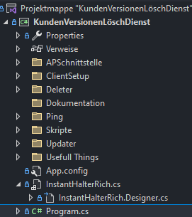
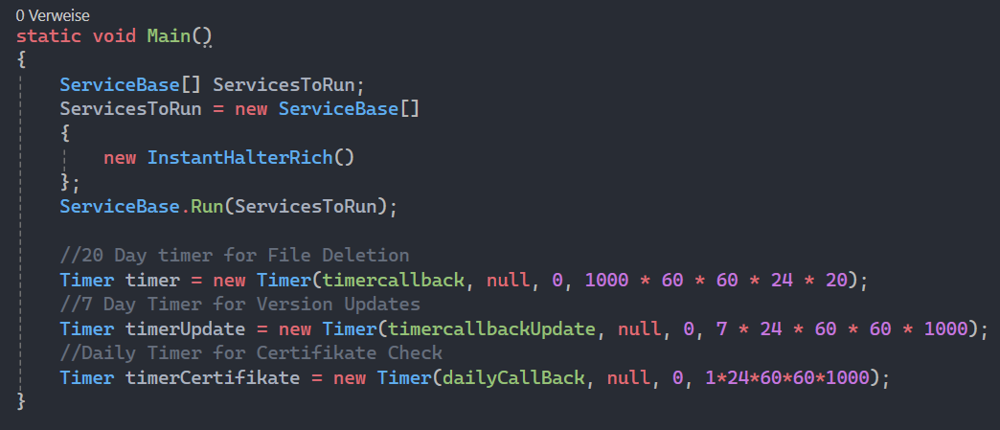
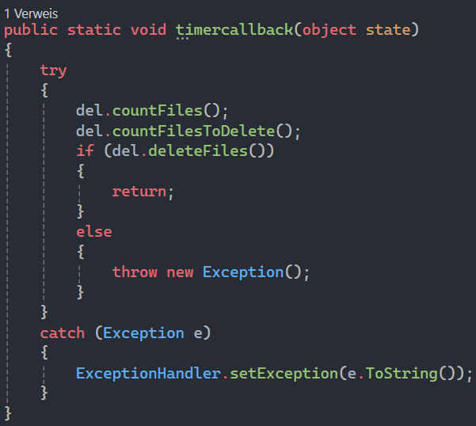
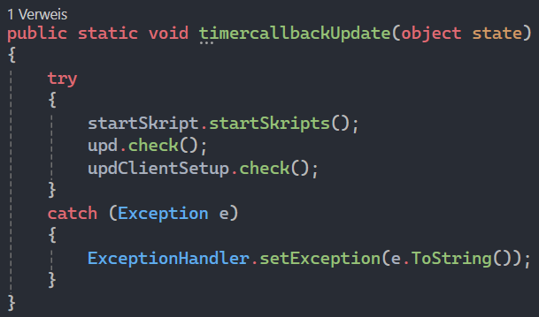
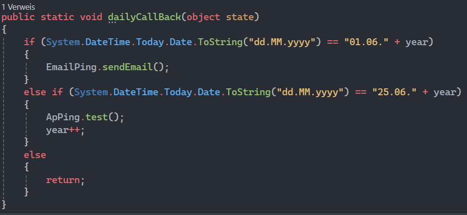

# Doku zum Instanthalterrich

Der instanthalterrich ist ein Windowsdienst, welcher den EDU01 Server, sowie den CVS Trainings Server verwaltet.

## Inhalt

- Aufgaben und Funktionsweise
- Aufbau
- Klassen
- Datenbanken

### Aufbau und Funktionsweise

Der Instanthatlerrich, ist ein Windowsdienst, welcher immer wieder auftretende Aufgaben, auf dem EDU01 Server automatisch ab arbeiten soll.

Die Aufgaben, die der Instanthalterrich bearbeiten kann:

- Updaten von Alphaplan Versionen
- Das Wiederherstellen von Datenbanken
- Das Updaten vom ClientSetup
- Erinnerungs E-Mails und einen AlphaPlan ping für das erneuern von dem SSL Zertifikat.
- Das Löschen von Kundendaten
- Das ausführen von den verschiedenen Skripten
- Bei Fehlern die Verantwortlichen informieren

### Aufbau

Das Programm so aufgebaut, dass es verschiedene Klassen gibt, welche aus der Hauptdatei (Program.cs) aufgerufen werden.
In der Hauptdatei, gibt es verschiedene Timer welche, wenn Sie ablaufen die verschiedenen Klassen aufrufen um die jeweilige Aufgabe zu bearbeiten.

So soll jede Woche geguckt werden, ob es eine neue Zugelassene Version für AlphaPlan gibt und sobald dies der Fall ist, soll auf diese geupdatet werden.
Jede Woche wird geguckt, ob das ClientSetup ein Update hat, sowie jede Woche die Skripte ausgeführt werden, so dass die Seminare vorbereitet sind

Alle Zwanzig Tage, soll geguckt werden, ob es Kunden Datein auf dem Server gibt, ist dies der Fall, sollen Sie gelöscht werden.

Sobald das aktuelle Datum dem 01.06. des Jahres entspricht, werden die Serververwalter per Ping und Email informiert, dass das SSL Zertifikat erneuert werden muss.

### Klassen

Die Verschiedenen Klassen, sind in Unterschiedlichen Ordnern zu finden.

Das gesamte Programm startet in der Program.cs Datei, welche aus verschiedenen Methoden besteht, welche durch Timer aufgerufen werden.

Hier werden einmal die Methoden aus der Klasse für das Löschen von Kundendaten aufgerufen.

Sollte ein Fehler auftreten, wird dies an einen Exception Handler weitergegeben.

Hier werden die Skripte für das zurücksetzten der Datenbanken gestartet, sowie die Updater für AlphaPlan und das ClientSetup.

Hier wird der Daily Check durchgeführt, um zu gucken, welches Datum der Aktuelle Tag hat, um zu gucken, ob eine Info für das Zertifikat von nöten ist.

